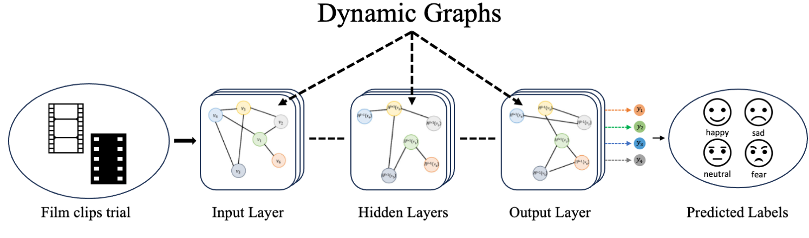

# EEG-Based Emotion Recognition using Dynamic Graph Convolutional Neural Networks

This repository contains the code for training and testing a Dynamical Graph Convolutional Neural Network for classifying emotions from EEG signals.



## Required Modules and Versions

The following Python modules are required for running the code:

- **tensorboard** == 2.13.0
- **tensorflow** == 2.13.0
- **torch** == 1.12.1
- **torch-geometric** == 2.3.1
- **torch-scatter** == 2.1.0+pt112cu102
- **torchaudio** == 0.12.1
- **torcheeg** == 1.0.11

Make sure to install these dependencies using the following command:

```bash
pip install tensorboard==2.13.0 tensorflow==2.13.0 torch==1.12.1 torch-geometric==2.3.1 torch-scatter==2.1.0+pt112cu102 torchaudio==0.12.1 torcheeg==1.0.11
```

## Run the code

Run the following code to train the model 
```bash
python script_name.py number_of_epochs ./train_fold -a
```

Run the following code to test a trained model
```bash
python script_name.py number_of_epochs ./saved_model_path -t
```
# If you want to read the entire paper, you can click [here](https://ieeexplore.ieee.org/abstract/document/10650427?casa_token=kAbRV7Vhd9YAAAAA:8EFN5mnwg0tfp-642l0ZyeSsvDJXnt-_zHY_TMmxq6GvhraV_BDqVbnf3XF49K5kUGFE81sCVA)


